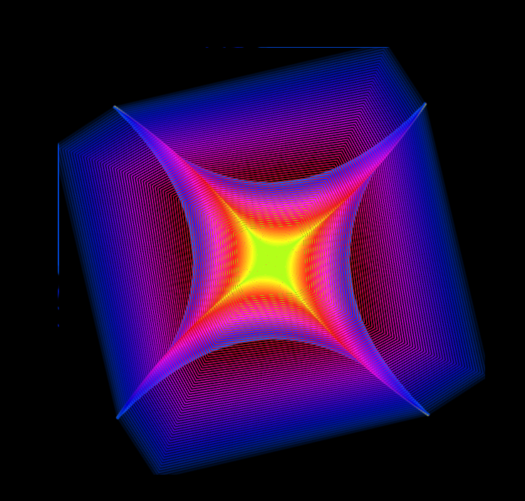
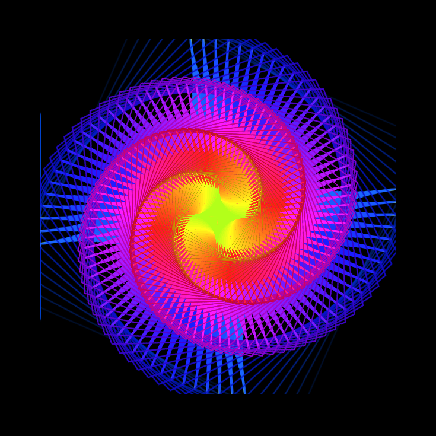
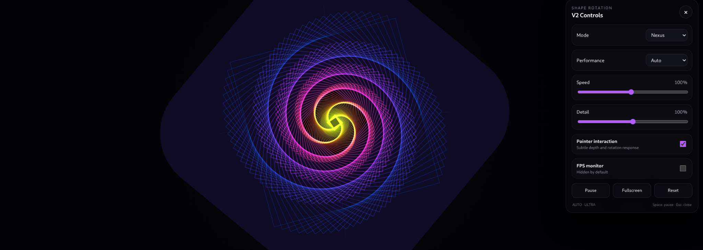

# Shape Rotation

**Shape Rotation** is a generative geometry experiment built with plain HTML, CSS, JavaScript, and the Canvas 2D API.

Version 2 is a complete rebuild of the original animation. It preserves the project's neon, mathematical, tunnel-like identity while replacing the old rendering approach with a responsive, adaptive, and more maintainable engine designed for smoother desktop and mobile use.

## Visual Evolution

### Version 1

The first version established the visual identity of Shape Rotation: dense geometric line structures, strong rotation, a black background, vivid rainbow transitions, and a bright central core.

<table>
  <tr>
    <td width="50%" align="center">
      
      <br>
      <strong>V1 — Square / tunnel composition</strong>
    </td>
    <td width="50%" align="center">
      
      <br>
      <strong>V1 — Spiral composition</strong>
    </td>
  </tr>
</table>

The original effect was visually striking, but the architecture relied on a heavier legacy rendering strategy with fixed internal dimensions, repeated drawing work, and no adaptive quality system for modern screens or mobile devices.

### Version 2



V2 keeps the recognizable neon geometry of the original project but rebuilds the animation around a single responsive Canvas 2D renderer, parametric geometry, controlled rendering density, and adaptive performance profiles.

The main **Nexus** mode acts as the direct successor to V1, while additional modes explore the same visual language in different mathematical arrangements.

## What Changed

| Feature | V1 | V2 |
|---|---|---|
| Rendering | Legacy multi-step Canvas workflow | Single optimized Canvas 2D renderer |
| Geometry | Repeated line-based drawing | Parametric reusable geometry |
| Resolution | Fixed internal canvas | Fully responsive viewport canvas |
| Mobile support | Limited | Adaptive mobile behavior |
| Device pixel ratio | No adaptive strategy | Capped and performance-aware DPR |
| Frame pacing | Display-rate dependent | Controlled, profile-aware rendering |
| Performance modes | None | Auto, Quality, Balanced, Eco |
| Adaptive quality | None | Automatic quality tiers |
| Pointer interaction | Basic / legacy | Smoothed Pointer Events |
| Hidden tab behavior | Rendering continues | Rendering pauses while hidden |
| Reduced motion | Not supported | `prefers-reduced-motion` support |
| Fullscreen | No | Yes |
| FPS monitor | No | Optional and disabled by default |
| Controls | Minimal | Responsive control panel |
| Accessibility | Minimal | Keyboard, focus, ARIA and motion support |
| Maintainability | Legacy structure | Reorganized and easier to extend |

## Main Improvements

### 1. Rebuilt Rendering Architecture

V2 is not a visual patch over the old code. The animation engine was redesigned so the project no longer depends on repeatedly copying and transforming a source canvas for every visible layer.

The new renderer draws a controlled set of mathematical paths directly into the visible canvas. This reduces unnecessary rendering work and makes performance easier to manage.

### 2. Responsive Canvas

The animation now adapts to the real viewport instead of relying on a fixed-size drawing surface.

It supports:

- desktop monitors;
- laptops;
- tablets;
- portrait and landscape mobile devices;
- high-DPI displays.

The device pixel ratio is capped according to the active performance profile so high-resolution screens do not increase rendering cost without limit.

### 3. Adaptive Performance

V2 includes four performance profiles:

- **Auto** — adjusts quality according to sustained runtime performance.
- **Quality** — prioritizes visual density.
- **Balanced** — balances visual quality and resource usage.
- **Eco** — reduces rendering cost for mobile devices, notebooks, or long sessions.

Auto mode can internally move between **LOW**, **MEDIUM**, **HIGH**, and **ULTRA** quality tiers instead of forcing the same workload on every device.

### 4. Better Frame Stability

The animation uses `requestAnimationFrame()` with time-based motion so speed is not tied directly to the monitor refresh rate.

The goal is stable frame pacing rather than simply rendering as many frames as the hardware can produce.

### 5. Lower Unnecessary Resource Usage

The V2 architecture avoids several common causes of excessive browser animation cost:

- no continuously growing arrays;
- no DOM queries inside the render loop;
- no external graphics libraries;
- no heavy blur pipeline;
- bounded geometric complexity;
- controlled DPR;
- profile-aware rendering density;
- automatic pause while the browser tab is hidden.

### 6. Modern Interaction

Pointer interaction is now subtle and smoothed instead of directly rebuilding the scene on every mouse movement.

Mouse and touch input influence the animation through target values that are interpolated inside the render loop, helping the visual remain fluid.

## Visual Modes

V2 currently includes four mathematical variations:

- **Nexus** — the direct visual successor to the original Shape Rotation.
- **Spiral** — stronger rotational flow and spiral depth.
- **Prism** — a more structured multi-sided tunnel.
- **Orbit** — elliptical geometry with softer orbital movement.

All modes share the same lightweight rendering architecture.

## Controls

Open the control button in the top-right corner to access:

- Mode
- Performance profile
- Speed
- Detail
- Pointer interaction
- FPS monitor
- Pause / Play
- Fullscreen
- Reset

### Keyboard Shortcuts

- **Space** — pause or resume the animation when a form control is not focused.
- **Escape** — close the control panel.

## Accessibility

V2 adds support for:

- semantic controls;
- ARIA labels;
- visible keyboard focus states;
- keyboard operation;
- adequate interface contrast;
- `prefers-reduced-motion`.

When reduced motion is enabled in the operating system, the animation automatically reduces its movement intensity and rendering frequency.

## Browser Lifecycle Optimization

The project uses the Page Visibility API.

When the tab becomes hidden, rendering is paused instead of continuing to consume CPU/GPU resources in the background. When the tab becomes active again, timing is safely restored to avoid large animation jumps.

## Rendering Technology

V2 intentionally stays with **Canvas 2D**.

For this project, the largest gains come from simplifying the rendering architecture and controlling geometric complexity. WebGL would introduce additional shader, buffer, context, and fallback complexity without being necessary for the current visual target.

This decision also keeps the repository extremely simple and compatible with direct local use and GitHub Pages.

## Technologies

- HTML5
- CSS3
- JavaScript
- Canvas 2D
- `requestAnimationFrame`
- Pointer Events
- ResizeObserver
- Page Visibility API
- Fullscreen API
- `prefers-reduced-motion`

No framework, package manager, backend, API, telemetry, cookie, or external runtime dependency is required.

## Project Structure

```text
Shape-rotation/
├── index.html
├── style.css
├── script.js
├── favicon.svg
├── README.md
├── shape-rotation-v1-square.png
├── shape-rotation-v1-spiral.png
└── shape-rotation-v2.png
```

## Running Locally

No build step is required.

1. Download or clone the repository.
2. Keep all project files in the same directory.
3. Open `index.html` in a modern browser.

On Linux, for example:

```bash
xdg-open index.html
```

Node.js, npm, a development server, and a backend are not required.

## GitHub Pages

The project is fully static and can be deployed directly with GitHub Pages.

Keep all files in the repository root and configure GitHub Pages to publish from that branch/root directory.

Because the README uses relative image paths, the V1 and V2 screenshots should remain in the same repository directory as `README.md`.

## V1 vs V2 Summary

**V1 created the identity. V2 modernizes the engine behind it.**

The first version introduced the dense rotating geometry, neon spectrum, dark background, and luminous center that define Shape Rotation. The second version keeps those ideas but replaces the old rendering approach with a responsive and adaptive system designed to be smoother, lighter, easier to maintain, and more suitable for modern desktop and mobile browsers.

The result is still unmistakably **Shape Rotation** — but now with a modern architecture behind the animation.
